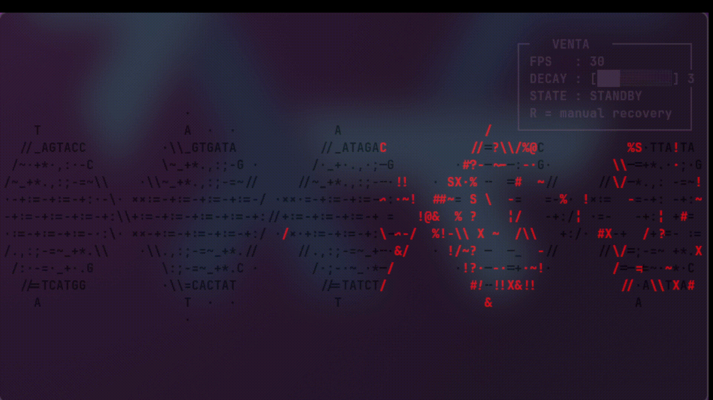

<h1 align="center">
	VENTA
</h1>
A mininal dna simulator with corruption,recovery,chaos mainly made to be just something to use in a screenshot 


<h1 align="center">
	Showcase
</h1>



## Table of Contents
- [INSTALLATION](#INSTALLATION)
- [CONFIGURATION](#CONFIGURATION)
- [USAGE](#USAGE)


<h1 align="center">
	INSTALLATION
</h1>

<details><summary><b>Nixos Linux</b></summary>

#### Flakes + Home Manager
- Into **flake.nix** add 
- ```venta.url = "github:realnrxg/venta";```
- And into outputs add venta
- exmp: ```outputs = {self, nixpkgs, home-manager, venta, ...}:```

- Into **home.nix** add
- ```{ pkgs, venta,  ... }:```
- and add
- 	```
	home.packages = with pkgs; [
	  venta.packages.${pkgs.stdenv.hostPlatform.system}.default
	];
	```
</details>

<h1 align="center">
	CONFIGURATION
</h1>

- Config is autogenerated into ~/.config/venta/config.json
- it consists of Dna color, corruption color, recovery color, and fps
	
<h1 align="center">
	USAGE
</h1>

run **venta** in your terminal
Press **r** if you wanna run a manually recovery
